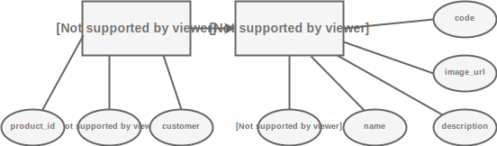
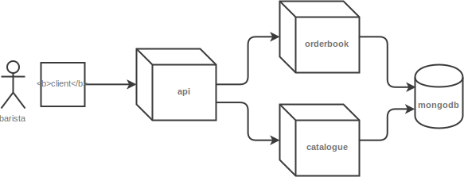

# ☕️🥐 coffeeshop

> Spring 5 + Kubernetes + Terraform

This demo application showcases how to use a [Reactive Web Application based on Spring 5](https://docs.spring.io/spring/docs/5.0.0.BUILD-SNAPSHOT/spring-framework-reference/html/web-reactive.html), deployed via [Terraform](https://terraform.io) onto a [Kubernetes](https://kubernetes.io) cluster.

## Prequisites

You need to install the following on your system to run this demo:

* 🐳 [Docker](https://www.docker.com)
* ⚓️ [Kubernetes](https://kubernetes.io)

## Install

To run the application, execute:
```bash
./start-coffeeshop.sh
```
## Introduction

Welcome to **CoffeeShop** - we offer freshly brewed coffee, cakes and delicious sandwiches. Demand grew a lot which made us move into the cloud. Our architecture allows us to take orders online via an API, we store our orders and can present them to our employees.

## Project Structure

This project consists of the following folders:

* `api/` - the frontend API component to serve requests from shops and clients
* `orderbook/` - the order component of the system
* `catalogue/` - the product catalogue of the coffeeshop
* `infrastructure/` - the infrastructure required, for example a `MongoDB` database, running via `docker-compose`.

Additionally, this project contains the following files:

* `start-coffeeshop.sh` - starts the entire coffeeshop in a local Kubernetes cluster

## Data Model

This demo consists of a data model like this:



## Architecture

The following diagram describes a high level architecture of this demo:



## Credits

This demo has been designed and built by [Miguel Gonzalez Sanchez](https://bitbrain.github.io). Make sure you follow me on Twitter [@bitbrain](https://twitter.com/bitbrain).
